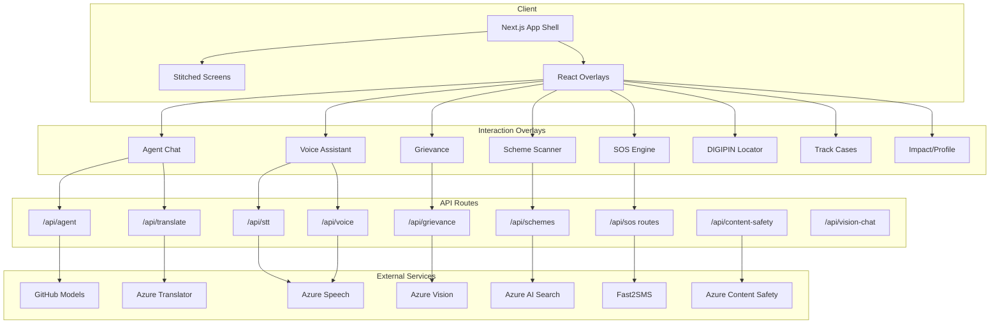

# Bharat Setu — Bridging the Digital Divide with Agentic Governance

<div align="center">


[](https://nextjs.org)
[](https://react.dev)
[](https://www.typescriptlang.org)
[](https://tailwindcss.com)
[](https://azure.microsoft.com)

**A multilingual, mobile-first governance platform for citizens and public service workflows.**  
*Voice + chat access · specialist agent routing · grievance workflows · scheme matching · DIGIPIN + SOS orchestration*

</div>

---

## Table of Contents

1. [Overview](#overview)
2. [Core Capabilities](#core-capabilities)
3. [System Architecture](#system-architecture)
4. [Tech Stack](#tech-stack)
5. [Project Structure](#project-structure)
6. [Getting Started](#getting-started)
7. [Environment Setup](#environment-setup)
8. [API Reference](#api-reference)
9. [Deployment](#deployment)
10. [Notes](#notes)

---

## Overview

**Bharat Setu** is a Next.js platform designed to reduce the navigation burden citizens face when accessing digital public services. Instead of expecting users to understand departments, forms, and portals, the app captures natural text/voice input, routes it to a specialist assistant, and drives users into actionable workflows.

The repository includes a working hybrid app shell with static stitched screens and stateful TypeScript overlays for high-trust interactions (chat, voice, grievance, scheme scanner, SOS, DIGIPIN, tracking, impact/profile).

---

## Core Capabilities

### 🧠 Council of Five Specialists
- **Nagarik Mitra** — civic and municipal workflows
- **Swasthya Sahayak** — health and emergency guidance
- **Yojana Saathi** — schemes, eligibility, and benefits
- **Arthik Salahkar** — finance, scams, and banking support
- **Vidhi Sahayak** — legal rights and FIR/legal aid pathways

### 🎙️ Voice + Multilingual Access
- 22-language onboarding and profile flow
- Voice assistant with intent classification and agent handoff
- Azure Speech-backed STT/TTS with robust browser fallback handling

### 🧾 Actionable Governance Workflows
- Grievance filing with image support and moderation checks
- Scheme matching with Azure AI Search fallback behavior
- Trackable case lifecycle and civic karma participation loop

### 📍 DIGIPIN + SOS Emergency Stack
- DIGIPIN encode/decode + geolocation integration
- SOS hold-to-trigger, optional voice trigger, responder fan-out
- Live status polling, location updates, offline queueing, SMS support

---

## System Architecture



---

## Tech Stack

### Frontend
| Component | Technology |
|---|---|
| Framework | Next.js 14 (App Router) |
| UI | React 18 + TypeScript |
| Styling | Tailwind CSS |
| Animation/Charts | Framer Motion, Recharts |
| State | Zustand |

### Backend (in-app API routes)
| Component | Technology |
|---|---|
| Server runtime | Next.js Route Handlers |
| AI routing | GitHub Models + model fallbacks |
| Speech | Azure Speech (STT/TTS) |
| Translation | Azure Translator |
| Safety/vision/search | Azure Content Safety, Vision, AI Search |

---

## Project Structure

```text
bharat-setu/
  src/
    app/
      api/
        agent/
        stt/
        voice/
        translate/
        grievance/
        schemes/
        sos/
        content-safety/
        vision-chat/
    components/
      AgentChat.tsx
      VoiceAssistant.tsx
      SOSButton.tsx
      ...
    lib/
      web-stt.ts
      sos-engine.ts
      store.ts
  public/
    screens/
  Dockerfile
  netlify.toml
```

---

## Getting Started

### Prerequisites
- Node.js 20+ (repo currently configured for Next.js 14)
- npm

### Install

```bash
npm install
```

### Run development server

```bash
npm run dev
```

Default URL: `http://localhost:3000`

### Build + start production

```bash
npm run build
npm run start
```

---

## Environment Setup

Create `.env.local` in project root and configure the services you need.

### Commonly used keys

```env
# Speech
AZURE_SPEECH_KEY=
AZURE_SPEECH_REGION=

# Translation
AZURE_TRANSLATOR_KEY=
AZURE_TRANSLATOR_REGION=

# Vision
AZURE_VISION_ENDPOINT=
AZURE_VISION_KEY=

# Content Safety
AZURE_CONTENT_SAFETY_ENDPOINT=
AZURE_CONTENT_SAFETY_KEY=

# Search
AZURE_SEARCH_ENDPOINT=
AZURE_SEARCH_KEY=
AZURE_SEARCH_INDEX=

# Model routing
GITHUB_TOKEN=
```

If some keys are missing, many workflows continue in fallback/demo-safe mode.

---

## API Reference

Base URL (local): `http://localhost:3000`

| Endpoint | Method | Purpose |
|---|---|---|
| `/api/health` | GET | Health check |
| `/api/agent` | POST | Specialist routing + response generation |
| `/api/stt` | POST | Speech-to-text transcription |
| `/api/voice` | POST | Text-to-speech generation |
| `/api/translate` | POST | Language translation |
| `/api/grievance` | POST | Grievance registration + enrichment |
| `/api/schemes` | POST | Scheme matching |
| `/api/content-safety` | POST | Safety moderation checks |
| `/api/sos` | POST | Start SOS workflow |
| `/api/sos/status` | GET | Poll responder status |
| `/api/sos/update-location` | POST | Live location updates |
| `/api/sos/sms` | POST | SMS escalation |
| `/api/vision-chat` | POST | Vision-assisted chat/grievance context |

---

## Deployment

### Docker

```bash
docker build -t bharat-setu .
docker run -p 3000:3000 --env-file .env.local bharat-setu
```

The included `Dockerfile` builds and runs the Next.js standalone output with `/api/health` health checks.

### Netlify

`netlify.toml` is configured with:
- `npm run build`
- `@netlify/plugin-nextjs`
- Node 20 build environment

---

## Notes

- The platform is optimized for mobile-first usage and layered fallback behavior.
- Architecture intentionally combines stitched static screens with reactive overlays.
- For detailed Azure setup guidance, see `AZURE_SETUP.md`.

---

<div align="center">

**Bharat Setu**  
*Inclusive digital governance through multilingual AI orchestration*

</div>
